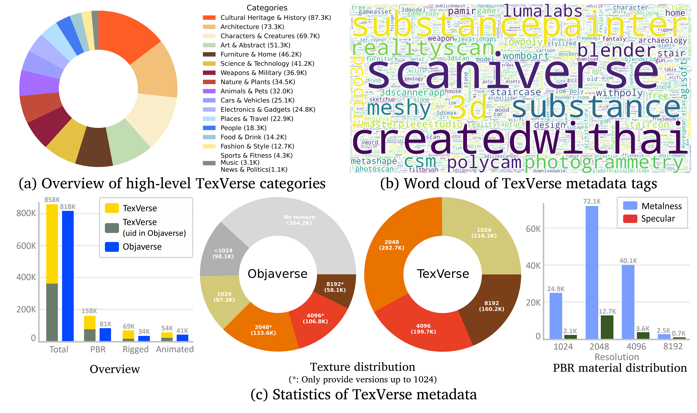

# TexVerse: A Universe of 3D Objects with High-Resolution Textures

<div align="center">
  <a href='#'></a> &nbsp;
  <a href='./assets/TexVerse.pdf'></a> &nbsp;

  <a href='https://huggingface.co/datasets/YiboZhang2001/TexVerse'>
  </a> &nbsp;
  <a href='https://huggingface.co/datasets/YiboZhang2001/TexVerse-1K'>
  </a> &nbsp;
  
  <a href='https://huggingface.co/datasets/YiboZhang2001/TexVerse-Skeleton-Animation'>
  </a> &nbsp;


**[Yibo Zhang<sup>1,2</sup>](https://yiboz2001.github.io/),  [Li Zhang<sup>1,3</sup>](https://lzrobots.github.io/),  [Rui Ma<sup>2 &ast;</sup>](https://ruim-jlu.github.io/), [Nan Cao<sup>1,4</sup>](http://nancao.org/)** 
<br>
<sup>1</sup>Shanghai Innovation Institute
<sup>2</sup>Jilin University 
<sup>3</sup>Fudan University 
<sup>4</sup>Tongji University 
<br>
&ast; Corresponding Author

</div>

## News

- [2025-08-11] We have released the **TexVerse** dataset. Feel free to download it.

## Abstract

**TexVerse is a large-scale 3D dataset featuring high-resolution textures.**
Its key characteristics include:
1. **Scale & Source**: **858,669 unique 3D models** curated from Sketchfab, including **158,518** with physically based rendering (PBR) materials.
2. **Variants**: Each model includes all high-resolution variants, resulting in a total of **1,659,097 3D instances**.
3. **Specialized Subsets**:
   For the rigged and animated categories of models, we further obtain the original user-uploaded file format to prevent the loss of skeletons and animations during the format conversion of Sketchfab. 
   - **TexVerse-Skeleton**: **69,138 rigged models**.
   - **TexVerse-Animation**: **54,430 animated models**.
4. **Annotations**: Detailed model annotations covering overall characteristics, structural components, and fine-grained features.

## Statistics



## Metadata

The following metadata files are provided in the `./metadata` folder
- **TexVerse Dataset**  
  - Dataset metadata: `metadata.json`  
  - Object ID list: `TexVerse_id_list.txt`  
  - PBR material model ID list: `TexVerse_pbr_id_list.txt`  
  - Annotations for a subset of 856,312 objects: `caption.json`  
- **TexVerse-Animation Dataset**  
  - Animated object ID list: `TexVerse-Animation_id_list.txt`  
- **TexVerse-Skeleton Dataset**  
  - Rigged object ID list: `TexVerse-Skeleton_id_list.txt`  

## License

Individual objects in TexVerse are all licensed as creative commons distributable objects. The metadata will provide the license for each object.

- [CC BY](https://creativecommons.org/licenses/by/4.0/): 699,075  
- [CC BY-NC-SA](https://creativecommons.org/licenses/by-nc-sa/4.0/): 88,710  
- [CC BY-SA](https://creativecommons.org/licenses/by-sa/4.0/): 14,624  
- [CC BY-NC](https://creativecommons.org/licenses/by-nc/4.0/): 31,514  
- [CC BY-NC-ND](https://creativecommons.org/licenses/by-nc-nd/4.0/): 11,599  
- [CC BY-ND](https://creativecommons.org/licenses/by-nd/4.0/): 7,008  
- [CC0](https://creativecommons.org/publicdomain/zero/1.0/): 6,139 

## Citation

```
```

